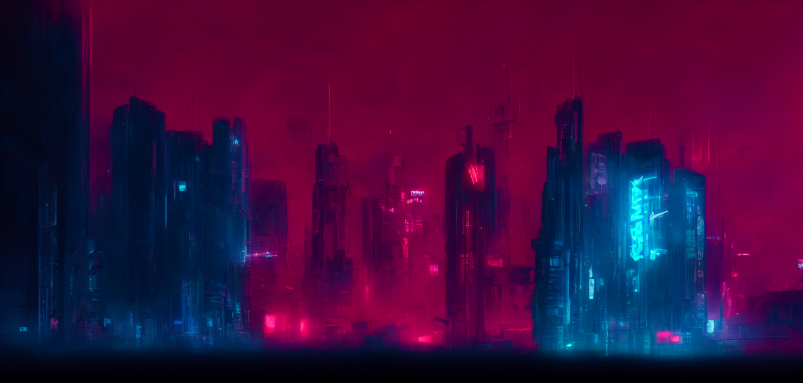

### About me

\> Mostly spend time writing code in Python

\> Working with: 
†:brain:†EEG processing 
†:art:†Generative models 
  :eye:  Computer Vision

\> Music enjoyer

\> File & folder avid organizer

\> Currently working on: 
†ğŸƒâ€â€ Mesh-based animation with Stable Diffusion 
  💡  Using EEG to guide image generation process

### Let's connect!

 
